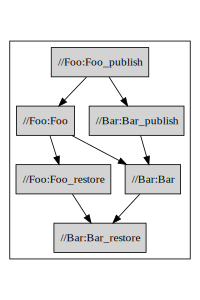

# Rules

These are the primary rules defined by rules_msbuild. The mose convenient way to use these rules is to have 
[@rules_msbuild//gazelle/dotnet](../gazelle/dotnet/Readme.md) generate and manage them for you. These rules are exported
 as macros that define three targets that mirror the dotnet restore, build and publish cycle:

1. `<name>_restore` to execute the `dotnet restore` equivalent
    1. When deps are provided, `<name>_restore` targets depend on `<depname>_restore`
1. `<name>` to execute the `dotnet build --no-restore` equivalent
    1. Depends on `<name>_restore`
    1. When deps are provided, depends on `<depname>` directly
1. `<name>_publish` to execute the `dotnet publish --no-build` equivalent
    1. When deps are provided, depends on `<depname>_publish`

For example, given `Foo.csproj`, a Console App, that references `Bar.csproj`, a 
Class Library:
```python
# //Foo:BUILD.bazel
msbuild_binary(
    name = "Foo",
    target_framework = "net5.0",
    deps = ["//Bar"],
)

# //Bar:BUILD.bazel
msbuild_library(
    name = "Bar",
    target_framework = "net5.0",
)
```

The following graph will be generated:



Specifying `is_packable = True` will also generate a `<name>.nupkg` target that depends 
on the `<name>_publish` target.


## msbuild_binary

**USAGE**

<pre>
msbuild_binary(<a href="#msbuild_binary-name">name</a>, <a href="#msbuild_binary-content">content</a>, <a href="#msbuild_binary-data">data</a>, <a href="#msbuild_binary-deps">deps</a>, <a href="#msbuild_binary-msbuild_directory">msbuild_directory</a>, <a href="#msbuild_binary-project_file">project_file</a>, <a href="#msbuild_binary-protos">protos</a>, <a href="#msbuild_binary-restore">restore</a>, <a href="#msbuild_binary-srcs">srcs</a>,
               <a href="#msbuild_binary-target_framework">target_framework</a>)
</pre>


**ATTRIBUTES**


<h4 id="msbuild_binary-name">name</h4>

(*<a href="https://bazel.build/docs/build-ref.html#name">Name</a>, mandatory*): A unique name for this target.


<h4 id="msbuild_binary-content">content</h4>

(*<a href="https://bazel.build/docs/build-ref.html#labels">List of labels</a>*): List of files to make available to MSBuild when executing Build and Publish targets.

ex: `content = ["appsettings.json]`
Corresponds to the `Content` Item type specified in a project file.
Setting this attribute does **not** impact MSBuild behavior, it only includes the files as inputs for the bazel
action, i.e. the target will be rebuilt if these files change.

To configure MSBuild behavior, such as for setting `<CopyToOutputDirectory>Always</CopyToOutputDirectory>`, use
XML in the project file as usual.

> Note: If a content file changes, bazel will re-execute the action and recompile the assembly. For maximum build
> caching, consider using the `data` attribute and the `@rules_msbuild//dotnet/tools/Runfiles` library instead. The
> `content` attribute is available only for familiar MSBuild semantics.

Defaults to `[]`

<h4 id="msbuild_binary-data">data</h4>

(*<a href="https://bazel.build/docs/build-ref.html#labels">List of labels</a>*): List of runfiles to be available at runtime. Use with `@rules_msbuild//dotnet/tools/Runfiles`.

Defaults to `[]`

<h4 id="msbuild_binary-deps">deps</h4>

(*<a href="https://bazel.build/docs/build-ref.html#labels">List of labels</a>*): The deps of this assembly. Must be a `rules_msbuild` assembly or a nuget package.

If your project file references a project not listed, the build will fail.

> Note: `@rules_msbuild//gazelle/dotnet` will maintain the `deps` attribute for you: After editing your project file,
> run `bazel run //:gazelle` (assuming your workspace was set up by `SamHowes.Bzl`).

Defaults to `[]`

<h4 id="msbuild_binary-msbuild_directory">msbuild_directory</h4>

(*<a href="https://bazel.build/docs/build-ref.html#labels">Label</a>*)

Defaults to `None`

<h4 id="msbuild_binary-project_file">project_file</h4>

(*<a href="https://bazel.build/docs/build-ref.html#labels">Label</a>, mandatory*): The project file for MSBuild to build. If not specified, a combination of `name` and the `srcs`
attribute will be used to infer the project file.

For example:
```python
# implicitly specifies `Foo.csproj`
msbuild_binary(
    name = "Foo",
    srcs = ["Program.cs"],
)
```

If `project_file` **is** specified, and the srcs attribute is not specified, the proper file extension will be inferred from the project
extension, and that file extension will be globbed.
```python
# implicitly sets `srcs = glob(["**/*.cs"])`
msbuild_binary(
    name = "Foo",
    project_file = "Foo.csproj",
)
```
> Note: while omitting the srcs attribute adheres to the [Sdk Project file semantics](https://docs.microsoft.com/en-us/dotnet/core/project-sdk/overview#default-includes-and-excludes),
> Using globs is inefficient for bazel, as bazel will have to query the file system for the list of files.


<h4 id="msbuild_binary-protos">protos</h4>

(*<a href="https://bazel.build/docs/build-ref.html#labels">List of labels</a>*): List of `proto_library` targets that this assembly depends on.

To compile those protos, use the [grpc-dotnet nuget package](https://github.com/grpc/grpc-dotnet#grpc-for-net) and
specify the proto in a `<Protobuf Include="<proto_file>"/>` element in your project file [as per the grpc-dotnet docs](https://docs.microsoft.com/en-us/aspnet/core/grpc/?view=aspnetcore-5.0#c-tooling-support-for-proto-files-1).

See [@rules_msbuild//tests/examples/Grpc](../tests/examples/Grpc/Readme.md) for examples.

Defaults to `[]`

<h4 id="msbuild_binary-restore">restore</h4>

(*<a href="https://bazel.build/docs/build-ref.html#labels">Label</a>, mandatory*): The restore target that this assembly depends on: `<name>_restore.`


<h4 id="msbuild_binary-srcs">srcs</h4>

(*<a href="https://bazel.build/docs/build-ref.html#labels">List of labels</a>*): Files to compile into the DLL: .cs, .fs, or .vb files.

If `project_file` is not specified, the extension of these files will be used to infer the project name.
i.e. given:
```
msbuild_binary(name = "Foo", srcs = ["Program.cs"])
```

rules_msbuild will attempt to compile `Foo.csproj`.

Defaults to `[]`

<h4 id="msbuild_binary-target_framework">target_framework</h4>

(*String, mandatory*): The [Target Framework Moniker (TFM)](https://docs.microsoft.com/en-us/dotnet/standard/frameworks#supported-target-frameworks)
of the target framework to compile for, i.e. `net5.0`, `netcoreapp3.1`, `netstandard2.0` etc.

* **Must** match the evaluated `<TargetFramework>` property in the project file
* **Must** be listed in the `target_frameworks` attribute of the `nuget_fetch` call for the workspace
* **Must not** be a target framework alias i.e. `net5.0-windows` see [issue #153](https://github.com/samhowes/rules_msbuild/issues/153)

If this target has NuGet dependencies, this TFM **must** be listed for restore in the `nuget_fetch`
call for the workspace.
```
msbuild_library(
    name = "Foo",
    srcs = ["Bar.cs"],
    target_framework = "net5.0",
    deps = ["@nuget//NewtonSoft.Json"],
)
```
Requires that the following must be specified:
```
nuget_fetch(
    name = "nuget",
    packages = {
        "NewtonSoft.Json/13.0.1": ["net5.0"],
    },
    target_frameworks = ["net5.0"],
)
```
> Note: `@rules_msbuild//gazelle/dotnet` will maintain the `target_framework` and `nuget_fetch` rule for you: After
> editing your project file, run `bazel run //:gazelle` (assuming your workspace was set up by `SamHowes.Bzl`).


## msbuild_library

**USAGE**

<pre>
msbuild_library(<a href="#msbuild_library-name">name</a>, <a href="#msbuild_library-content">content</a>, <a href="#msbuild_library-data">data</a>, <a href="#msbuild_library-deps">deps</a>, <a href="#msbuild_library-msbuild_directory">msbuild_directory</a>, <a href="#msbuild_library-project_file">project_file</a>, <a href="#msbuild_library-protos">protos</a>, <a href="#msbuild_library-restore">restore</a>, <a href="#msbuild_library-srcs">srcs</a>,
                <a href="#msbuild_library-target_framework">target_framework</a>)
</pre>


**ATTRIBUTES**


<h4 id="msbuild_library-name">name</h4>

(*<a href="https://bazel.build/docs/build-ref.html#name">Name</a>, mandatory*): A unique name for this target.


<h4 id="msbuild_library-content">content</h4>

(*<a href="https://bazel.build/docs/build-ref.html#labels">List of labels</a>*): List of files to make available to MSBuild when executing Build and Publish targets.

ex: `content = ["appsettings.json]`
Corresponds to the `Content` Item type specified in a project file.
Setting this attribute does **not** impact MSBuild behavior, it only includes the files as inputs for the bazel
action, i.e. the target will be rebuilt if these files change.

To configure MSBuild behavior, such as for setting `<CopyToOutputDirectory>Always</CopyToOutputDirectory>`, use
XML in the project file as usual.

> Note: If a content file changes, bazel will re-execute the action and recompile the assembly. For maximum build
> caching, consider using the `data` attribute and the `@rules_msbuild//dotnet/tools/Runfiles` library instead. The
> `content` attribute is available only for familiar MSBuild semantics.

Defaults to `[]`

<h4 id="msbuild_library-data">data</h4>

(*<a href="https://bazel.build/docs/build-ref.html#labels">List of labels</a>*): List of runfiles to be available at runtime. Use with `@rules_msbuild//dotnet/tools/Runfiles`.

Defaults to `[]`

<h4 id="msbuild_library-deps">deps</h4>

(*<a href="https://bazel.build/docs/build-ref.html#labels">List of labels</a>*): The deps of this assembly. Must be a `rules_msbuild` assembly or a nuget package.

If your project file references a project not listed, the build will fail.

> Note: `@rules_msbuild//gazelle/dotnet` will maintain the `deps` attribute for you: After editing your project file,
> run `bazel run //:gazelle` (assuming your workspace was set up by `SamHowes.Bzl`).

Defaults to `[]`

<h4 id="msbuild_library-msbuild_directory">msbuild_directory</h4>

(*<a href="https://bazel.build/docs/build-ref.html#labels">Label</a>*)

Defaults to `None`

<h4 id="msbuild_library-project_file">project_file</h4>

(*<a href="https://bazel.build/docs/build-ref.html#labels">Label</a>, mandatory*): The project file for MSBuild to build. If not specified, a combination of `name` and the `srcs`
attribute will be used to infer the project file.

For example:
```python
# implicitly specifies `Foo.csproj`
msbuild_binary(
    name = "Foo",
    srcs = ["Program.cs"],
)
```

If `project_file` **is** specified, and the srcs attribute is not specified, the proper file extension will be inferred from the project
extension, and that file extension will be globbed.
```python
# implicitly sets `srcs = glob(["**/*.cs"])`
msbuild_binary(
    name = "Foo",
    project_file = "Foo.csproj",
)
```
> Note: while omitting the srcs attribute adheres to the [Sdk Project file semantics](https://docs.microsoft.com/en-us/dotnet/core/project-sdk/overview#default-includes-and-excludes),
> Using globs is inefficient for bazel, as bazel will have to query the file system for the list of files.


<h4 id="msbuild_library-protos">protos</h4>

(*<a href="https://bazel.build/docs/build-ref.html#labels">List of labels</a>*): List of `proto_library` targets that this assembly depends on.

To compile those protos, use the [grpc-dotnet nuget package](https://github.com/grpc/grpc-dotnet#grpc-for-net) and
specify the proto in a `<Protobuf Include="<proto_file>"/>` element in your project file [as per the grpc-dotnet docs](https://docs.microsoft.com/en-us/aspnet/core/grpc/?view=aspnetcore-5.0#c-tooling-support-for-proto-files-1).

See [@rules_msbuild//tests/examples/Grpc](../tests/examples/Grpc/Readme.md) for examples.

Defaults to `[]`

<h4 id="msbuild_library-restore">restore</h4>

(*<a href="https://bazel.build/docs/build-ref.html#labels">Label</a>, mandatory*): The restore target that this assembly depends on: `<name>_restore.`


<h4 id="msbuild_library-srcs">srcs</h4>

(*<a href="https://bazel.build/docs/build-ref.html#labels">List of labels</a>*): Files to compile into the DLL: .cs, .fs, or .vb files.

If `project_file` is not specified, the extension of these files will be used to infer the project name.
i.e. given:
```
msbuild_binary(name = "Foo", srcs = ["Program.cs"])
```

rules_msbuild will attempt to compile `Foo.csproj`.

Defaults to `[]`

<h4 id="msbuild_library-target_framework">target_framework</h4>

(*String, mandatory*): The [Target Framework Moniker (TFM)](https://docs.microsoft.com/en-us/dotnet/standard/frameworks#supported-target-frameworks)
of the target framework to compile for, i.e. `net5.0`, `netcoreapp3.1`, `netstandard2.0` etc.

* **Must** match the evaluated `<TargetFramework>` property in the project file
* **Must** be listed in the `target_frameworks` attribute of the `nuget_fetch` call for the workspace
* **Must not** be a target framework alias i.e. `net5.0-windows` see [issue #153](https://github.com/samhowes/rules_msbuild/issues/153)

If this target has NuGet dependencies, this TFM **must** be listed for restore in the `nuget_fetch`
call for the workspace.
```
msbuild_library(
    name = "Foo",
    srcs = ["Bar.cs"],
    target_framework = "net5.0",
    deps = ["@nuget//NewtonSoft.Json"],
)
```
Requires that the following must be specified:
```
nuget_fetch(
    name = "nuget",
    packages = {
        "NewtonSoft.Json/13.0.1": ["net5.0"],
    },
    target_frameworks = ["net5.0"],
)
```
> Note: `@rules_msbuild//gazelle/dotnet` will maintain the `target_framework` and `nuget_fetch` rule for you: After
> editing your project file, run `bazel run //:gazelle` (assuming your workspace was set up by `SamHowes.Bzl`).


## msbuild_test

**USAGE**

<pre>
msbuild_test(<a href="#msbuild_test-name">name</a>, <a href="#msbuild_test-content">content</a>, <a href="#msbuild_test-data">data</a>, <a href="#msbuild_test-deps">deps</a>, <a href="#msbuild_test-dotnet_cmd">dotnet_cmd</a>, <a href="#msbuild_test-msbuild_directory">msbuild_directory</a>, <a href="#msbuild_test-project_file">project_file</a>, <a href="#msbuild_test-protos">protos</a>,
             <a href="#msbuild_test-restore">restore</a>, <a href="#msbuild_test-srcs">srcs</a>, <a href="#msbuild_test-target_framework">target_framework</a>, <a href="#msbuild_test-test_env">test_env</a>)
</pre>


**ATTRIBUTES**


<h4 id="msbuild_test-name">name</h4>

(*<a href="https://bazel.build/docs/build-ref.html#name">Name</a>, mandatory*): A unique name for this target.


<h4 id="msbuild_test-content">content</h4>

(*<a href="https://bazel.build/docs/build-ref.html#labels">List of labels</a>*): List of files to make available to MSBuild when executing Build and Publish targets.

ex: `content = ["appsettings.json]`
Corresponds to the `Content` Item type specified in a project file.
Setting this attribute does **not** impact MSBuild behavior, it only includes the files as inputs for the bazel
action, i.e. the target will be rebuilt if these files change.

To configure MSBuild behavior, such as for setting `<CopyToOutputDirectory>Always</CopyToOutputDirectory>`, use
XML in the project file as usual.

> Note: If a content file changes, bazel will re-execute the action and recompile the assembly. For maximum build
> caching, consider using the `data` attribute and the `@rules_msbuild//dotnet/tools/Runfiles` library instead. The
> `content` attribute is available only for familiar MSBuild semantics.

Defaults to `[]`

<h4 id="msbuild_test-data">data</h4>

(*<a href="https://bazel.build/docs/build-ref.html#labels">List of labels</a>*): List of runfiles to be available at runtime. Use with `@rules_msbuild//dotnet/tools/Runfiles`.

Defaults to `[]`

<h4 id="msbuild_test-deps">deps</h4>

(*<a href="https://bazel.build/docs/build-ref.html#labels">List of labels</a>*): The deps of this assembly. Must be a `rules_msbuild` assembly or a nuget package.

If your project file references a project not listed, the build will fail.

> Note: `@rules_msbuild//gazelle/dotnet` will maintain the `deps` attribute for you: After editing your project file,
> run `bazel run //:gazelle` (assuming your workspace was set up by `SamHowes.Bzl`).

Defaults to `[]`

<h4 id="msbuild_test-dotnet_cmd">dotnet_cmd</h4>

(*String*)

Defaults to `"test"`

<h4 id="msbuild_test-msbuild_directory">msbuild_directory</h4>

(*<a href="https://bazel.build/docs/build-ref.html#labels">Label</a>*)

Defaults to `None`

<h4 id="msbuild_test-project_file">project_file</h4>

(*<a href="https://bazel.build/docs/build-ref.html#labels">Label</a>, mandatory*): The project file for MSBuild to build. If not specified, a combination of `name` and the `srcs`
attribute will be used to infer the project file.

For example:
```python
# implicitly specifies `Foo.csproj`
msbuild_binary(
    name = "Foo",
    srcs = ["Program.cs"],
)
```

If `project_file` **is** specified, and the srcs attribute is not specified, the proper file extension will be inferred from the project
extension, and that file extension will be globbed.
```python
# implicitly sets `srcs = glob(["**/*.cs"])`
msbuild_binary(
    name = "Foo",
    project_file = "Foo.csproj",
)
```
> Note: while omitting the srcs attribute adheres to the [Sdk Project file semantics](https://docs.microsoft.com/en-us/dotnet/core/project-sdk/overview#default-includes-and-excludes),
> Using globs is inefficient for bazel, as bazel will have to query the file system for the list of files.


<h4 id="msbuild_test-protos">protos</h4>

(*<a href="https://bazel.build/docs/build-ref.html#labels">List of labels</a>*): List of `proto_library` targets that this assembly depends on.

To compile those protos, use the [grpc-dotnet nuget package](https://github.com/grpc/grpc-dotnet#grpc-for-net) and
specify the proto in a `<Protobuf Include="<proto_file>"/>` element in your project file [as per the grpc-dotnet docs](https://docs.microsoft.com/en-us/aspnet/core/grpc/?view=aspnetcore-5.0#c-tooling-support-for-proto-files-1).

See [@rules_msbuild//tests/examples/Grpc](../tests/examples/Grpc/Readme.md) for examples.

Defaults to `[]`

<h4 id="msbuild_test-restore">restore</h4>

(*<a href="https://bazel.build/docs/build-ref.html#labels">Label</a>, mandatory*): The restore target that this assembly depends on: `<name>_restore.`


<h4 id="msbuild_test-srcs">srcs</h4>

(*<a href="https://bazel.build/docs/build-ref.html#labels">List of labels</a>*): Files to compile into the DLL: .cs, .fs, or .vb files.

If `project_file` is not specified, the extension of these files will be used to infer the project name.
i.e. given:
```
msbuild_binary(name = "Foo", srcs = ["Program.cs"])
```

rules_msbuild will attempt to compile `Foo.csproj`.

Defaults to `[]`

<h4 id="msbuild_test-target_framework">target_framework</h4>

(*String, mandatory*): The [Target Framework Moniker (TFM)](https://docs.microsoft.com/en-us/dotnet/standard/frameworks#supported-target-frameworks)
of the target framework to compile for, i.e. `net5.0`, `netcoreapp3.1`, `netstandard2.0` etc.

* **Must** match the evaluated `<TargetFramework>` property in the project file
* **Must** be listed in the `target_frameworks` attribute of the `nuget_fetch` call for the workspace
* **Must not** be a target framework alias i.e. `net5.0-windows` see [issue #153](https://github.com/samhowes/rules_msbuild/issues/153)

If this target has NuGet dependencies, this TFM **must** be listed for restore in the `nuget_fetch`
call for the workspace.
```
msbuild_library(
    name = "Foo",
    srcs = ["Bar.cs"],
    target_framework = "net5.0",
    deps = ["@nuget//NewtonSoft.Json"],
)
```
Requires that the following must be specified:
```
nuget_fetch(
    name = "nuget",
    packages = {
        "NewtonSoft.Json/13.0.1": ["net5.0"],
    },
    target_frameworks = ["net5.0"],
)
```
> Note: `@rules_msbuild//gazelle/dotnet` will maintain the `target_framework` and `nuget_fetch` rule for you: After
> editing your project file, run `bazel run //:gazelle` (assuming your workspace was set up by `SamHowes.Bzl`).


<h4 id="msbuild_test-test_env">test_env</h4>

(*<a href="https://bazel.build/docs/skylark/lib/dict.html">Dictionary: String -> String</a>*)

Defaults to `{}`


